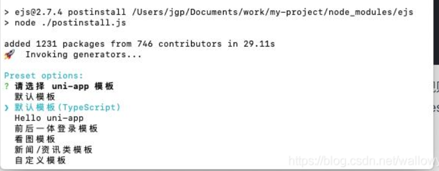
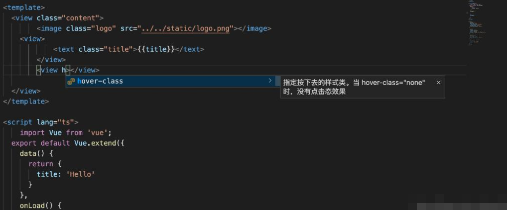
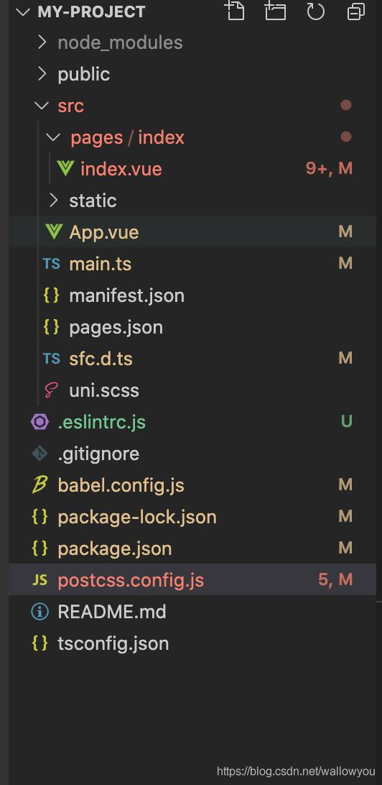

参考文档: `https://ask.dcloud.net.cn/article/id-36286__page-2`

1. 安装vetur
首先我们需要安装vscode基本的vue插件vetur，在vscode扩展程序中即可安装

2. 安装eslint
在vscode中安装eslint扩展

3. 配置vscode的setting.json
  VSCode进行扩展设置，依次点击 文件 > 首选项 > 设置 打开 VSCode 配置文件settings.json,添加如下配置
  ————————————————

  ```
  {
     "files.autoSave": "off",
     "eslint.validate": [
         "javascript",
         "javascriptreact",
         "vue-html",
         {
         "language": "vue",
         "autoFix": true
         }
     ],
     "eslint.run": "onSave",
     "editor.tabSize": 2,
     "editor.codeActionsOnSave": {
         "source.fixAll.eslint": true
     }
    }
  
  ```

  自动格式化vue的项目也是如此，以上是部分配置，不要把原有配置删掉了
  *注意*

  不同版本的vscode配置可能有些许区别，如果哪个配置有问题，vscode会有提示

4. ### 使用vue-cli创建一个uniapp项目。

   *需要保证你已经全局安装vue-cli,没有的话先安装vue-cli*
   `vue create -p dcloudio/uni-preset-vue my-project`

    

5. ### 在项目中安装组件语法提示

   `npm i @dcloudio/uni-helper-json`,如果你的package.json文件中已经安装了的话就不需要安装
   此时我们可以看到组件的语法提示

  

6. vscode安装uniapp-snippet插件

7. 保存自动格式化代码
  可以看到此时页面中的格式比较混乱，看着很难受，然后保存也并不会自动格式化，所以我们需要给项目添加eslint
  vue add eslint
  我们选择最后一个prettier
  安装完成之后我们可以看到我们的项目多了一些文件，可以自行在.eslintrc.js文件配置规则

   

  我们可以看到一些配置的js文件报错了，我们在这些文件首尾忽略eslint检查即可
  比如`postcss.config.js`

  ```
  /* eslint-disable */
  const path = require("path");
  module.exports = {
    parser: require("postcss-comment"),
    plugins: [
      require("postcss-import")({
        resolve(id, basedir, importOptions) {
          if (id.startsWith("~@/")) {
            return path.resolve(process.env.UNI_INPUT_DIR, id.substr(3));
          } else if (id.startsWith("@/")) {
            return path.resolve(process.env.UNI_INPUT_DIR, id.substr(2));
          } else if (id.startsWith("/") && !id.startsWith("//")) {
            return path.resolve(process.env.UNI_INPUT_DIR, id.substr(1));
          }
          return id;
        },
      }),
      require("autoprefixer")({
        remove: process.env.UNI_PLATFORM !== "h5",
      }),
      require("@dcloudio/vue-cli-plugin-uni/packages/postcss"),
    ],
  };
  /* eslint-disable */
  
  ```

  其他配置的js文件也类似操作这样配置完之后我们保存代码就会自动格式化了

  8. 导入 HBuilderX 自带的代码块
  从 github 下载 uni-app 代码块，放到项目目录下的 .vscode 目录即可拥有和 HBuilderX 一样的代码块。d代码块下载地址https://github.com/zhetengbiji/uniapp-snippets-vscode

  9. uni，plus等报错
  当我们使用uni或者plus的时候会提示我们uni或者plus未定义，那么我们可以配置.eslintrc,增加的配置如下：
  globals: { uni: true, wx: true,plus: true }


