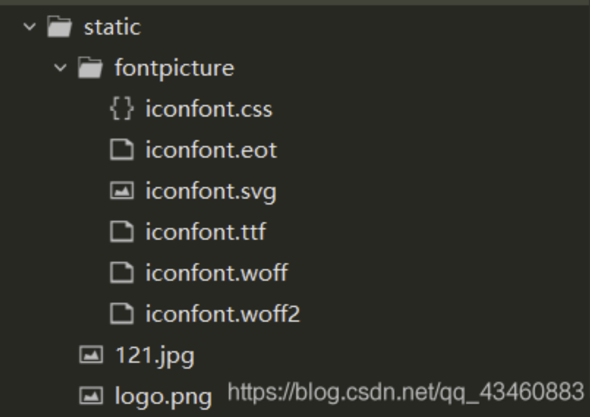
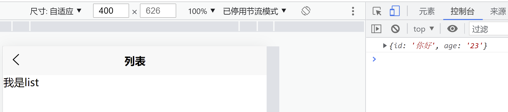

# 基本使用

## 环境搭建

安装编辑器 HbuilderX [下载地址](https://www.dcloud.io/hbuilderx.html)

安装微信开发者工具 [下载地址](https://developers.weixin.qq.com/miniprogram/dev/devtools/download.html)


vscode环境搭建

https://ask.dcloud.net.cn/article/id-36286__page-2


## 利用 HbuilderX初始化项目

* 点击HbuilderX菜单栏 文件->项目->新建
* 选择uni-app，填写项目名称，项目创建的目录


## 如何运行项目

官方文档 [地址](https://uniapp.dcloud.io/quickstart-hx)

1）创建项目

文件 -> 新建 -> 项目

选择`uni-app`类型，输入工程名，选择模板，点击创建，即可成功创建。


2）运行项目

2.1）运行在浏览器

工具栏的运行 -> 运行到浏览器 -> 选择浏览器


2.2）运行在微信编辑器

在微信开发者工具里运行：进入hello-uniapp项目，点击工具栏的运行 -> 运行到小程序模拟器 -> 微信开发者工具，即可在微信开发者工具里面体验uni-app

**注意：**如果是第一次使用，需要先配置小程序ide的相关路径，才能运行成功。如下图，需在输入框输入微信开发者工具的安装路径。 若HBuilderX不能正常启动微信开发者工具，需要开发者手动启动，然后将uni-app生成小程序工程的路径拷贝到微信开发者工具里面，在HBuilderX里面开发，在微信开发者工具里面就可看到实时的效果。

uni-app默认把项目编译到根目录的unpackage目录。


2.3）运行在手机，比如 安卓手机

连接手机，开启USB调试，进入hello-uniapp项目，点击工具栏的运行 -> 真机运行 -> 选择运行的设备，即可在该设备里面体验uni-app


## 介绍项目目录及作用

pages.json 文件用来对 uni-app 进行全局配置，决定页面文件的路径、窗口样式、原生的导航栏、底部的原生tabbar 等。

manifest.json 文件是应用的配置文件，用于指定应用的名称、图标、权限等。

App.vue是我们的根组件，所有页面都是在App.vue下进行切换的，是页面入口文件，可以调用应用的生命周期函数。

main.js是我们的项目入口文件，主要作用是初始化vue实例并使用需要的插件。

uni.scss文件的用途是为了方便整体控制应用的风格。比如按钮颜色、边框风格，uni.scss文件里预置了一批scss变量预置。

unpackage就是打包目录，在这里有各个平台的打包文件。

pages所有的页面存放目录。

static静态资源目录，例如图片等。

components组件存放目录。

为了实现多端兼容，综合考虑编译速度、运行性能等因素，uni-app 约定了如下开发规范：

* 页面文件遵循 Vue 单文件组件 (SFC) 规范

* 组件标签靠近小程序规范，详见uni-app 组件规范
* 接口能力（JS API）靠近微信小程序规范，但需将前缀 wx 替换为 uni，详见uni-app接口规范

* 数据绑定及事件处理同 Vue.js 规范，同时补充了App及页面的生命周期

* 为兼容多端运行，建议使用flex布局进行开发

# 全局配置和页面配置

## 通过globalStyle 进行全局配置

用于设置应用的状态栏、导航条、标题、窗口背景色等，[详细文档](https://uniapp.dcloud.io/collocation/pages?id=globalstyle)

| 属性                         | 类型     | 默认值  | 描述                                                         | 平台差异说明                                     |
| :--------------------------- | :------- | :------ | :----------------------------------------------------------- | :----------------------------------------------- |
| navigationBarBackgroundColor | HexColor | #F7F7F7 | 导航栏背景颜色（同状态栏背景色）                             | APP与H5为#F7F7F7，小程序平台请参考相应小程序文档 |
| navigationBarTextStyle       | String   | white   | 导航栏标题颜色及状态栏前景颜色，仅支持 black/white           |                                                  |
| navigationBarTitleText       | String   |         | 导航栏标题文字内容                                           |                                                  |
| navigationStyle              | String   | default | 导航栏样式，仅支持 default/custom。custom即取消默认的原生导航栏，需看[使用注意](https://uniapp.dcloud.io/collocation/pages?id=customnav) | 微信小程序 7.0+、百度小程序、H5、App（2.0.3+）   |
| backgroundColor              | HexColor | #ffffff | 下拉显示出来的窗口的背景色                                   | 微信小程序                                       |
| backgroundTextStyle          | String   | dark    | 下拉 loading 的样式，仅支持 dark / light                     | 微信小程序                                       |
| enablePullDownRefresh        | Boolean  | false   | 是否开启下拉刷新，详见[页面生命周期](https://uniapp.dcloud.io/collocation/frame/lifecycle?id=页面生命周期)。 |                                                  |
| onReachBottomDistance        | Number   | 50      | 页面上拉触底事件触发时距页面底部距离，单位只支持px，详见[页面生命周期](https://uniapp.dcloud.io/collocation/frame/lifecycle?id=页面生命周期) |                                                  |

全局配置在`pages.json` 里

```json
{
	"pages": [ //pages数组中第一项表示应用启动页，参考：https://uniapp.dcloud.io/collocation/pages
		{
			"path": "pages/index/index",
			"style": {
				"navigationBarTitleText": "uni-app"
			}
		}
	],
	"globalStyle": {
		"navigationBarTextStyle": "black",
		"navigationBarTitleText": "uni-app",
		"navigationBarBackgroundColor": "#F8F8F",
		"backgroundColor": "#F8F8F8",
		"enablePullDownRefresh": true
	}
}
```


## 创建新的message页面

右键`pages`新建`message`目录，在`message`目录下右键新建`vue`文件,并选择基本模板。

```vue
<template>
	<view>this is message view</view>
</template>

<script>
</script>

<style>
</style>
```


## 通过pages配置页面

pages.json 来配置显示 message 页面，以及可以给 message 设置 style 效果

官方文档： [地址](https://uniapp.dcloud.io/collocation/pages?id=pages)

```json
{
	"pages": [
		{
			"path": "pages/message/message",
			"style": {
				"navigationBarTitleText": "信息页",
				// 单独设置h5的 style ，也可以设置微信，app等
				"h5": {
					"pullToRefresh" : {
						"color" : "#007AFF"
					}
				}
			}
		},
		{
			"path": "pages/index/index",
			"style": {
				"navigationBarTitleText": "uni-app"
			}
		}
	],
	"globalStyle": {
		"navigationBarTextStyle": "black",
		"navigationBarTitleText": "uni-app",
		"navigationBarBackgroundColor": "#F8F8F8",
		"backgroundColor": "#F8F8F8",
		"enablePullDownRefresh": true
	}
}
```


## 配置tabbar

官方文档：[地址](https://uniapp.dcloud.io/collocation/pages?id=tabbar)

如果应用是一个多 tab 应用，可以通过 tabBar 配置项指定一级导航栏，以及 tab 切换时显示的对应页

**Tips**

- 当设置 position 为 top 时，将不会显示 icon
- tabBar 中的 list 是一个数组，只能配置最少2个、最多5个 tab，tab 按数组的顺序排序。

**属性说明：**

| 属性            | 类型     | 必填 | 默认值 | 描述                                                         | 平台差异说明                                         |
| :-------------- | :------- | :--- | :----- | :----------------------------------------------------------- | :--------------------------------------------------- |
| color           | HexColor | 是   |        | tab 上的文字默认颜色                                         |                                                      |
| selectedColor   | HexColor | 是   |        | tab 上的文字选中时的颜色                                     |                                                      |
| backgroundColor | HexColor | 是   |        | tab 的背景色                                                 |                                                      |
| borderStyle     | String   | 否   | black  | tabbar 上边框的颜色，可选值 black/white                      | App 2.3.4+ 支持其他颜色值、H5 3.0.0+                 |
| blurEffect      | String   | 否   | none   | iOS 高斯模糊效果，可选值 dark/extralight/light/none（参考:[使用说明](https://ask.dcloud.net.cn/article/36617)） | App 2.4.0+ 支持、H5 3.0.0+（只有最新版浏览器才支持） |
| list            | Array    | 是   |        | tab 的列表，详见 list 属性说明，最少2个、最多5个 tab         |                                                      |
| position        | String   | 否   | bottom | 可选值 bottom、top                                           | top 值仅微信小程序支持                               |


其中 list 接收一个数组，数组中的每个项都是一个对象，其属性值如下：

| 属性             | 类型   | 必填 | 说明                                                         | 平台差异 |
| :--------------- | :----- | :--- | :----------------------------------------------------------- | :------- |
| pagePath         | String | 是   | 页面路径，必须在 pages 中先定义                              |          |
| text             | String | 是   | tab 上按钮文字，在 App 和 H5 平台为非必填。例如中间可放一个没有文字的+号图标 |          |
| iconPath         | String | 否   | 图片路径，icon 大小限制为40kb，建议尺寸为 81px * 81px，当 position 为 top 时，此参数无效，不支持网络图片，不支持字体图标 |          |
| selectedIconPath | String | 否   | 选中时的图片路径，icon 大小限制为40kb，建议尺寸为 81px * 81px ，当 position 为 top 时，此参数无效 |          |

代码演示：

pages.json

```json
"tabBar": {
		"list" : [
			{
				"text": "首页",
				"pagePath" : "pages/index/index",
				"iconPath":"static/tabs/home.png",
				"selectedIconPath" : "./static/tabs/home-active.png"
			},
			{
				"text": "信息",
				"pagePath" : "pages/message/message",
				"iconPath":"static/tabs/message.png",
				"selectedIconPath" : "./static/tabs/message-active.png"
			},
			{
				"text": "我们",
				"pagePath" : "pages/contact/contact",
				"iconPath":"static/tabs/contact.png",
				"selectedIconPath" : "./static/tabs/contact-active.png"
			}
		]
	}
```


## condition 启动模式

官方文档：[地址](https://uniapp.dcloud.io/collocation/pages?id=condition)

启动模式配置，仅开发期间生效，用于模拟直达页面的场景，如：小程序转发后，用户点击所打开的页面。

**属性说明：**

| 属性    | 类型   | 是否必填 | 描述                             |
| :------ | :----- | :------- | :------------------------------- |
| current | Number | 是       | 当前激活的模式，list节点的索引值 |
| list    | Array  | 是       | 启动模式列表                     |

**list说明：**

| 属性  | 类型   | 是否必填 | 描述                                                         |
| :---- | :----- | :------- | :----------------------------------------------------------- |
| name  | String | 是       | 启动模式名称                                                 |
| path  | String | 是       | 启动页面路径                                                 |
| query | String | 否       | 启动参数，可在页面的 [onLoad](https://uniapp.dcloud.io/collocation/frame/lifecycle?id=页面生命周期) 函数里获得 |


**注意：** 在 App 里真机运行可直接打开配置的页面，微信开发者工具里需要手动改变编译模式，如下图：

 

**代码示例：**

```javascript
"condition": { //模式配置，仅开发期间生效
    "current": 0, //当前激活的模式（list 的索引项）
    "list": [{
            "name": "swiper", //模式名称
            "path": "pages/component/swiper/swiper", //启动页面，必选
            "query": "interval=4000&autoplay=false" //启动参数，在页面的onLoad函数里面得到。
        },
        {
            "name": "test",
            "path": "pages/component/switch/switch"
        }
    ]
}
```


## 全局配置索引

pages.json配置的项目：

* 页面的路径path；每在pages里新建的页面都要在这里进行路径的补充。

* 通过style修改页面的标题和导航栏背景色。

* 通过globalStyle来设置默认页面的窗口表现。

* 通过tabBar来配置底部导航栏。

* 通过condition启动模式配置（用户点击直达的页面，如转发什么的），仅开发者模式。

# 组件使用

## text 组件

官方文档：[地址](https://uniapp.dcloud.io/component/text)

```vue
	<view>
		<view>
			<text>我是文本内容</text>
		</view>
		<view>
			<text selectable="true">我是文本内容</text>
		</view>
		<view>
			<text space='ensp' style="font-size:30px;">我是 文本</text>
			 <!-- 长按文本是否可选;中文字符空格一半大小;字符大小30px -->
		</view>
	</view>
```


## view组件

官方文档：[地址](https://uniapp.dcloud.io/component/view)

它类似于传统html中的div，用于包裹各种元素内容。

如果使用[nvue](https://uniapp.dcloud.io/nvue-outline)，则需注意，包裹文字应该使用`<text>`组件。


**属性说明**

| 属性名                 | 类型    | 默认值 | 说明                                                         |
| :--------------------- | :------ | :----- | :----------------------------------------------------------- |
| hover-class            | String  | none   | 指定按下去的样式类。当 hover-class="none" 时，没有点击态效果 |
| hover-stop-propagation | Boolean | false  | 指定是否阻止本节点的祖先节点出现点击态，App、H5、支付宝小程序、百度小程序不支持（支付宝小程序、百度小程序文档中都有此属性，实测未支持） |
| hover-start-time       | Number  | 50     | 按住后多久出现点击态，单位毫秒                               |
| hover-stay-time        | Number  | 400    | 手指松开后点击态保留时间，单位毫秒                           |

```vue
<template>
	<view class="outbox" hover-class="outbox-active">
	   <view class="box" hover-class="box-active" hover-stop-propagation="true" hover-start-time="2000" hover-stay-time="2000">
		我是一个盒子
		</view>
	</view>    <!-- 绑定叫box的样式；按下去的样式；阻止父节点出现点击态；按住后多久出现点击态，单位毫秒；手指松开后点击态保留时间 -->
</template>

<style>
	.box{
		width: 100px;
		height: 100px;
		background: green;
	}
	.box-active{
		width: 100px;
		height: 100px;
		background: red;
	}
	.outbox{
		width: 200px;
		height: 200px;
		background: blue;
	}
	.outbox-active{
		width: 200px;
		height: 200px;
		background: pink;
	}
</style>
```

## button按钮

官方文档：[地址](https://uniapp.dcloud.io/component/button)

`button` 组件默认独占一行，设置 `size` 为 `mini` 时可以在一行显示多个。

```vue
<button size='mini' type='primary'>前端</button>

<button size='mini' type='default' disabled='true'>前端</button>

<button size='mini' type='warn' loading='true'>前端</button>
```


## image 组件

官方文档：[地址](https://uniapp.dcloud.io/component/image)

插入图像的组件，`image·`组件默认宽度 300px、高度 225px；`app-nvue`平台，暂时默认为屏幕宽度.

`src`可以支持线上网址；注意：线上的网址结尾是图片的格式，并不是网页，复制过来的应该是图片的地址！

```vue
<view>
		<image src="../../static/121.jpg"></image>
</view>
<view>
    <image src="https://scpic.chinaz.net/files/pic/pic9/202104/hpic3876.jpg"></image>
</view>
```


# uni-app 中的 样式

## rpx自适应单位

详见`uni-app`官网-框架简介-页面布局与样式-尺寸单位

`rpx` 即响应式`px`，一种根据屏幕宽度自适应的动态单位。以750宽的屏幕为基准，750rpx恰好为屏幕宽度。屏幕变宽，rpx 实际显示效果会等比放大；也可以用在文字上。

```vue
<template>
	<view>
		<view class="newbox">样式学习</view>	
	</view>
</template>

<style>
	.newbox{
		width: 375rpx;
		height: 375rpx;
		background: #FFC0CB;
		color: #4CD964;
		font-size: 50rpx;
	}
</style>
```

这里的375就是750基准的一半，实际显示过程中根据屏幕尺寸显示屏幕的一半。


## @import

使用`@import`语句可以导入外联样式表，`@import`后跟需要导入的外联样式表的相对路径，用`;`表示语句结束。

```vue
<template>
	<view>
		<view>nishiwo</view> 
		<view class="newbox">样式学习</view>	
		<view>1213241</view>
	</view>
</template>

<style>
	@import url("./style.css");
	.newbox{
		width: 375rpx;
		height: 750rpx;
		background: #FFC0CB;
		color: #4CD964;
		font-size: 50rpx;
	}
</style>

```

注意以上代码，除了“样式学习”绑定了`class`样式，其他两行文字没有绑定，就全都用了`css`文件的样式。


## 全局样式与局部样式

官网-介绍-框架简介-页面样式与布局-全局样式与局部样式 [地址](https://uniapp.dcloud.io/frame?id=%e5%85%a8%e5%b1%80%e6%a0%b7%e5%bc%8f%e4%b8%8e%e5%b1%80%e9%83%a8%e6%a0%b7%e5%bc%8f)

定义在App.vue中的样式为全局样式，作用于每一个页面。在 pages 目录下 的vue 文件中定义的样式为局部样式，只作用在对应的页面，并会覆盖App.vue 中相同的选择器。

选择器种类可以看uni-app官网-框架简介-页面布局与样式-选择器。

意思就是在app.vue中写的.class类会被页面中.vue文件的.class类覆盖掉；这里的class类名要一样。

```
app.vue  中代码
<style>
	.newbox{
		background:blue ;
	}
</style>

某一页面中的vue
<style>
	.newbox{
		width: 375rpx;
		height: 750rpx;
		background: #FFC0CB;
		color: #4CD964;
		font-size: 50rpx;
	}
</style>

```

以上代码类名相同为newbox，这时页面的会覆盖整体的；如果把页面中的background注释掉，那么整体的蓝色background会生效，并且页面中的newbox类的其他属性一样生效！如果类名不同那么就无法覆盖。

app.vue补充的是其他页面的相同类名中的相同设置项！可以理解为App.vue是全部页面vue文件的整体设置。

并且，在app.vue中添加好的样式什么的，不在具体的页面上引用的话，也不会显示。它的作用就是先放在整体的vue中之后就可以在各个页面vue进行引用了。


## 字体图标的使用

官网-介绍-框架简介-页面样式与布局-字体图标 [地址](https://uniapp.dcloud.io/frame?id=%e5%ad%97%e4%bd%93%e5%9b%be%e6%a0%87)

字体图标简单的说，就是一种特殊的字体，通过这种字体，显示给用户的就像一个个图片一样，字体图标最大的好处，在于它不会变形和加载速度快。字体图标可以像文字一样，随意通过CSS来控制它的大小和颜色。

使用本地路径图标字体需注意：
为方便开发者，在字体文件小于 40kb 时，uni-app 会自动将其转化为 base64格式；
字体文件大于等于 40kb，仍转换为 base64 方式使用的话可能有性能问题，如开发者必须使用，则需自己将其转换为 base64 格式使用，或将其挪到服务器上，从网络地址引用；
字体文件的引用路径推荐使用以 ~@ 开头的绝对路径。

使用方法：先把本地的字体图标文件添加到项目中，再更改字体图标的css文件里边的路径为~@形式；然后可以在页面定义class类别引用图标了。

```vue
<template>
	<view>
		<view class="iconfont icon-tupian"></view>
	</view>
</template>

<style>
	@import url("../../static/fontpicture/iconfont.css"); 
</style>

```

或者是在`app.vue`中总体载入。

```vue
<style>
	/*每个页面公共css */
	 @import url("./static/fontpicture/iconfont.css");
</style>
```

导入字体图标的文件进项目

 


## 使用scss全局变量

官网-介绍-框架简介-页面样式与布局-全局样式与局部样式 [地址](https://uniapp.dcloud.io/frame?id=%e5%85%a8%e5%b1%80%e6%a0%b7%e5%bc%8f%e4%b8%8e%e5%b1%80%e9%83%a8%e6%a0%b7%e5%bc%8f)

使用的是`uni.scss`文件，`uni.scss`文件的用途是为了方便整体控制应用的风格。比如按钮颜色、边框风格，uni.scss文件里预置了一批`scss`变量预置。

在使用`lang="scss"`之前要安装`scss`插件；在工具中的插件安装。

```
页面的vue文件中
<template>
	<view>
		<view class="newbox">样式学习
		<text>新学习</text>
		</view>	
		<view>1213241</view>
	</view>
</template>

<style lang="scss">                        //这里引用scss全局样式文件
	@import url("./style.css");            //这里是引用外部css样式
	.newbox{
		width: 375rpx;
		height: 750rpx;
		background: $uni-color-primary;            //使用了预置的颜色变量
		color: #4CD964;
		font-size: 50rpx;
		text{
		color:pink;             //注意这里的text是在newbox样式下的，可以单独给text设置样式
		}                       //不单独设置text的颜色，默认使用的是color: #4CD964;
	}
</style>

```

以上代码`background`使用了`uni.scss`的预置变量，颜色变量可在`uni.scss`文件中查看。

# uni-app 中的数据绑定

## 数据绑定{{}}

官网-介绍-vue教程-基础-模板语法-插值 [地址](https://uniapp.dcloud.io/vue-basics?id=%e6%8f%92%e5%80%bc)

```vue
<template>
	<view>
		<view>  {{msg}}   msg  </view>            <!-- Hello Vue  msg -->
		<view>数据的拼接：{{number+'我是你爸爸'}}</view>  <!-- 1我是你爸爸 -->
		<view>三目运算：{{flag?'我是真':'我是假'}}</view>  <!-- 结果是  我是真 -->
		<view>运算{{1+2}}</view> <!-- 结果为 3 -->
	</view>
</template>

<script>
	 export default {
	        data() {
	            return {
	                msg: 'Hello Vue!',
					flag:true,
					number:1
	            }
	        }
	    }
</script>
```

{undefined{msg}}里的内容将会被替代为对应数据对象上`msg`的值。无论何时，绑定的数据对象上`msg`发生了改变，插值处的内容都会更新。


## v-bind

官网-介绍-vue教程-基础-模板语法-指令 [地址](https://uniapp.dcloud.io/vue-basics?id=%e6%8c%87%e4%bb%a4)

```vue
<template>
	<view>
		<image :src="path"></image>   <!-- v-bind:src="path" -->  <!-- :src="path"  -->
	</view>
</template>

<script>
	 export default {
		data() {
			return {
				path:"https://scpic.chinaz.net/files/pic/pic9/202104/hpic3876.jpg",
			}
		}
	}
</script>
```


上述代码，显示的时候`path`并不会被解析成网址，只是一个字符串；加上`v-bind`才会被解析成网址。

`v-bind`的缩写`:`，以上注释的两种写法都可。


## v-for指令

`v-for`：官网-介绍-vue教程-基础-列表渲染 [官方文档](https://uniapp.dcloud.io/vue-basics?id=listrendering)

`v-for` 指令可以实现基于一个数组来渲染一个列表。

```vue
<template>
	<view>
		<view v-for="(item,index) in array">
			默认索引：{{index}},姓名：{{item.name}},年龄：{{item.age}},序号：{{item.number}}
		</view>
	</view>
</template>

<script>
	 export default {
		data() {
			return {
				array:[
					{
						name:"宋小宝",
						age:"18",
						number:1
					},
					{
						name:"小沈阳",
						age:22,
						number:2
					},
					{
						name:"赵四",
						age:33,
						number:3
					}
				]
			}
		}
	}
</script>
```


## v-on指令

v-on 指令，它用于监听 DOM 事件。v-on缩写为‘ @ ’，下文简称为 @事件  [官方文档](https://uniapp.dcloud.io/vue-basics?id=%e6%8c%87%e4%bb%a4)

```vue
<template>
	<view>
		<button @click="clickhandle(25,$event)">我是个绑定了点击事件的按钮</button>
	</view>
</template>

<script>
	 export default {
	        data() {
	            return {
	            }
	        },
			methods:{
				clickhandle(number,e){
					console.log('点击我了',number,e)
				}
			}
		}
</script>
```

`console.log`是打印的意思，在页面的调试中可以看到。以上代码用`v-on`指令为按钮绑定了点击事件，同时此事件`clickhandle`传回参数，一个是`25`，另一个是 事件对象

# uni-app 生命周期

官网-框架-框架接口-生命周期 [官方文档](https://uniapp.dcloud.io/collocation/frame/lifecycle)

生命周期的概念：一个对象从创建、运行、销毁的整个过程被成为生命周期。

生命周期函数：在生命周期中每个阶段会伴随着每一个函数的触发，这些函数被称为生命周期函数

生命周期分app的和页面的，app的在App.vue中设置，页面的在页面vue中设置。

```vue
<script>
	export default {
		onLaunch: function() {
			console.log('App Launch')
		},
		onShow: function() {
			console.log('App Show')
		},
		onHide: function() {
			console.log('App Hide')
		}
	}
</script>
```


# 下拉刷新

## 开启下拉刷新

### 通过配置文件开启

pages.json/定义过`"enablePullDownRefresh":true`， 开启全局下拉刷新


### 通过api开启

uni官网-API-界面-下拉刷新 [官方文档](https://uniapp.dcloud.io/api/ui/pulldown)

通过调用`uni.startPullDownRefresh`方法来开启下拉刷新


## 监听下拉刷新

[官方文档](https://uniapp.dcloud.io/api/ui/pulldown?id=onpulldownrefresh)

`onPullDownRefresh`:在 js 中定义 onPullDownRefresh 处理函数（和`onLoad`等生命周期函数同级），监听该页面用户下拉刷新事件。


## 关闭下拉刷新

[官方文档](https://uniapp.dcloud.io/api/ui/pulldown?id=stoppulldownrefresh)

`uni.stopPullDownRefresh()`:停止当前页面下拉刷新。


```vue
<template>
	<view>
		<view v-for="item in array">
			{{item}}
		</view>
		<button @click="refresh">刷新按钮</button>
	</view>
</template>

<script>
	export default{
		data(){
			return {
				array:['1','2','3','4','1','2','3','4']
			}
		},
		onPullDownRefresh() {
			console.log('监听到下拉刷新了'),
			setTimeout( ()=>{ 
				this.array = ['4','3','2','1'],
				uni.stopPullDownRefresh()
			},2000)
		},
		methods:{
			refresh(){
				uni.startPullDownRefresh()
			}
		}
		
	}
</script>

<style>
</style>

```

```vue
// 2S 超时 触发关闭下拉刷新
setTimeout( ()=>{ 
	this.array = ['4','3','2','1'],
	uni.stopPullDownRefresh()
},2000)
```


# 上拉加载

官网-框架-框架接口-生命周期  [官网文档](https://uniapp.dcloud.io/collocation/frame/lifecycle?id=%e5%ba%94%e7%94%a8%e7%94%9f%e5%91%bd%e5%91%a8%e6%9c%9f)

```vue
<template>
	<view>
		<view class="ibox" v-for="item in array">
			{{item}}
		</view>
	</view>
</template>

<script>
	export default{
		data(){
			return {
				array:['1','2','3','4','1','2','3','4']
			}
		},
		onReachBottom() {
			console.log("触底了")
			// this.array = [...this.array,...['45','99','77','96']]   <!-- 加载的数组就是原数组的基础上新加的 --> 
		},		
	}
</script>

<style>
	.ibox{
		height: 100px;
		line-height: 600px;
	}
</style>

```

# 网络请求

官网-API-网络-发起请求 [官网文档](https://uniapp.dcloud.io/api/request/request)

```vue
<template>
	<view>
		<button @click="get">发送get请求</button>
		<view class="ibox" v-for="item in array">
			{{item}}
		</view>
	</view>
</template>

<script>

		methods:{
			get(){
				uni.request({
					url:"http://localhost:8082/api/getlunbo",
					success(rrr) {
						console.log(rrr)
					}
				})
			}
		}
		
	}
</script>

```

# 数据缓存

官网-API-数据缓存 [官方文档](https://uniapp.dcloud.io/api/storage/storage?id=setstorage)

## uni.setStorage

将数据存储在本地缓存中指定的 key 中，会覆盖掉原来该 key 对应的内容，这是一个异步接口。


## uni.setStorageSync

将 data 存储在本地缓存中指定的 key 中，会覆盖掉原来该 key 对应的内容，这是一个同步接口。


## uni.getStorage

从本地缓存中异步获取指定 key 对应的内容。


## uni.getStorageSync

从本地缓存中同步获取指定 key 对应的内容。


## uni.removeStorage

从本地缓存中异步移除指定 key。


## uni.removeStorageSync

从本地缓存中同步移除指定 key。


```vue
<template>
	<view>
		<button @click="set">存储数据</button>
		<button @click="getdata">获取数据</button>
		<button @click="remove">删除数据</button>
	</view>
</template>

<script>
	export default{
		methods:{
			set(){
				uni.setStorage({
					key:"id",
					data:100
				})
			},
			getdata(){
				uni.getStorage({
					key:"id",
					success(ew){
						console.log(ew.data)
					}
				})
			},
			remove(){
				uni.removeStorage({
					key:"id",
					success() {
						console.log('删除成功')
					}
				})
			}
		}
		
	}
</script>
```


# 上传图片、预览图片

思路：图片的上传利用uni.chooseImage函数，并且返回一个图片的地址数组，我们用个空的数组去接收这个地址数组，然后利用image组件进行动态显示出来

最后预览用uni.previewImage函数，注意预览的是点击的那个图片，那么应该在点击事件发生时传回一个参数，这个参数就是点击的图片的地址。

## 上传图片

uni-api-媒体-图片 [官方文档](https://uniapp.dcloud.io/api/media/image)


## 预览图片

uni-api-媒体-图片 [官方文档](https://uniapp.dcloud.io/api/media/image?id=unipreviewimageobject)


```vue
<template>
	<view>
		<button @click="setup">图片上传</button>
		<image :src="item" v-for="item in array" @click="preview(item)"></image> 
	</view> <!-- 注意这里是动态的绑定地址，冒号 -->   <!-- 点击时传回一个当前点击的图片的地址的参数 -->
</template>

<script>
	export default{
		data(){
			return{
				array:[]       /* 准备一个空数组进行保存图片地址数组 */
			}
		},
		methods:{
			setup(){
				uni.chooseImage({
					count:5,
					success:res=>{
						this.array = res.tempFilePaths     /* 注意这个数组更新的写法 */
					}
				})
			},
			preview(current){         /* 这里预览的是点击的图片,需要点击的时候传递回来图片的地址 */
				uni.previewImage({
					current:'current',  /* 键名和值一样,可以简写成 current, */
					urls:this.array      /* 这个是预览的图片组的地址,可以在预览的时候滑动预览其他图片 */
				})
			}
		}
	}
</script>

<style>
</style>
```

# 条件编译实现跨端兼容

[官方文档](https://uniapp.dcloud.io/platform?id=preprocessor)

条件编译是用特殊的注释作为标记，在编译时根据这些特殊的注释，将注释里的代码编译在不同平台。

写法：以 #ifdef 加平台标识开头，以endif结尾。

平台标识

| 值         | 平台                                                   | 参考文档 |
| ---------- | ------------------------------------------------------ | -------- |
| APP-PLUS   | 5+App                                                  |          |
| H5         | H5                                                     |          |
| MP-WEIXIN  | 微信小程序                                             |          |
| MP-ALIPAY  | 支付宝小程序                                           |          |
| MP-BAIDU   | 百度小程序                                             |          |
| MP-TOUTIAO | 头条小程序                                             |          |
| MP-QQ      | qq小程序                                               |          |
| MP         | 微信小程序/支付宝小程序/百度小程序/头条小程序/qq小程序 |          |


## 组件的条件注释

```vue
<template>
	<view>
		<!-- #ifdef H5 -->
		<view>h5才会显示</view>
		<!-- #endif -->
		
		<!-- #ifdef MP-WEIXIN -->
		<view>微信小程序才会显示</view>
		<!-- #endif -->
	</view>
</template>
```


## api的条件注释

```vue
<script>
	export default {
		onLoad() {
			// #ifdef H5
			console.log("我是 h5")
			// #endif
			
			// #ifdef MP-WEIXIN
			console.log("我是微信")
			// #endif
		}
	}
</script>
```

# uni中的导航跳转

利用 navigator进行跳转

利用编程式导航进行跳转

导航跳转传递参数

```vue
<template>
	<view>
		<navigator url="../list/list?id=你好&age=23">跳转至普通页面，我会传参</navigator><!-- 不关闭页面，可以返回 -->
		<navigator url="../list/list" open-type="redirect">跳转至普通页面，我不会传参</navigator><!-- 关闭页面 -->
		<navigator url="../index/index" open-type="switchTab">跳转到tablebar页面</navigator>
		<!-- 跳转的页面区分类型，需要设置打开的类型 -->
		<button @click="jump">跳转至普通页面</button>
		<button @click="jump1">跳转到tablebar页面</button>
	</view>
</template>

<script>
	export default{
		methods:{
			jump(){
				uni.navigateTo({
					url:"../list/list"
				})
			},
			jump1(){
				uni.switchTab({
					url:"../index/index"
				})
			}
		}
	}
</script>
```

list.vue

```vue
<template>
	<view>我是list</view>
</template>

<script>
	export default{
		onLoad(data) {
			console.log(data)
		}
	}
</script>

<style>
</style>
```

 

# uni-app 中组件的创建

## 自定义组件

[官方文档](https://uniapp.dcloud.io/component/)

在uni-app中，可以通过创建一个后缀为vue的文件，即创建一个组件成功，其他组件将该组件通过 import 的方式导入，在通过 components进行注册即可。

* 创建 test 组件，创建 components/test/test.vue文件

  ```vue
  <template>
  	<view>
  		我是自定义组件
  	</view>
  </template>
  
  <script>
  	export default {
  		name:"test",
  		data() {
  			return {
  				
  			};
  		}
  	}
  </script>
  
  <style>
  
  </style>
  
  ```

* 在其他组件中导入该组件并注册

  ```
  import test from "components/test/test.vue"
  ```

  注册组件

  ```
  export default {
  		components: {
  			test: test
  		}
  	}
  ```

  使用组件

  ```
  <template>
  	<view class="content">
  		<!-- 我是引入的test组件 -->
  		<test></test>
  	</view>
  </template>
  ```

  完整使用组件代码如下

  ```vue
  <template>
  	<view class="content">
  		<!-- 我是引入的test组件 -->
  		<test></test>
  	</view>
  </template>
  
  <script>
  	import test from "components/test/test.vue"
  	
  	export default {
  		components: {
  			test: test
  		}
  	}
  </script>
  
  <style>
  	
  </style>
  ```


## 组件的生命周期函数

| beforeCreate  | 在实例初始化只会被调用。[详见]()                             |              |
| ------------- | ------------------------------------------------------------ | ------------ |
| created       | 在实例创建完成后立即被调用。[详见]()                         |              |
| beforeMount   | 在挂载开始之前被调用。[详见]()                               |              |
| mounted       | 挂载到实例上去之后调用。[详见]() 注意：此处并不能确定子组件被全部挂载。如果需要子组件全部挂载之后执行操作可以使用 $nextTick [Vue官方文档]() |              |
| beforeUpdate  | 数据更新时调用，发生在虚拟DOM打补丁之前。[详见]()            | 仅H5平台支持 |
| updated       | 由于数据更改导致的虚拟DOM重新渲染和打补丁，在这之后会调用该钩子。[详见]() | 仅H5平台支持 |
| beforeDestroy | 实例销毁之前调用。在这一步，实例完全可用。[详见]()           |              |
| destroyed     | Vue 实例销毁后调用。调用后，Vue实例指示的所有东西都会解绑，所有的时间监听会被移除，所有的子实例也会被销毁。[详见]() |              |

 在 components/test/test.vue

```vue
<script>
	export default {
		name:"test",
		data() {
			return {
			};
		},
		created() {
			console.log('组件，created')
		},
	}
</script>
```

# uni-app 组件的通讯

## 父组件给子组件传值

传数据通过属性绑定传递，接收通过`props`接收。

```vue
<template>
	<view>这是一个自定义组件, 我接受到了父组件的数据{{msg}}</view>
</template>
<script>
	export default{
        props: ['msg']
    }
</script>
```

其他组件在使用 test 组件的时候传递值

```vue
<template>
	<test :msg="msg"></test>
</template>
<script>
	import test from "components/test/test.vue"
	
	export default {
        data () {
          return {
              msg: "hello"
          }  
        },
		components: {
			test: test
		}
	}
</script>
```


## 子组件给父组件传值

通过注册自定义事件实现。

uni-框架-框架接口-页面通讯 [官方文档](https://uniapp.dcloud.io/collocation/frame/communication)


在子组件中定义一个事件叫`myeven`

components/test/test.vue

```vue
<template>
	<view>
		我是自定义组件, 我接受到了父组件的数据{{msg}}
		<button @click="sendnum">给父组件传值</button>
	</view>
</template>

<script>
	export default {
		name:"test",
		data() {
			return {
				num:30
			};
		},
		props: ['msg'],
		methods:{
			sendnum(){
				this.$emit('myeven',this.num)
			}
		}
	}
</script>
```

在父组件中调用的子组件上绑定这个自定义事件并且调用的函数，定义函数体并且显示，实现点击按钮一次就将子组件传过来的值进行相加运算。

```vue
<template>
	<view>
		<view>
			我是message页面
			<view>我接收到了子组件的传值是：{{num}}</view>
		</view>
		<!-- 我是引入的test组件 -->
		<test :msg="msg" @myeven="getnum"></test>
	</view>	
</template>

<script>
	import test from "components/test/test.vue"
	export default {
		data () {
			return {
				msg: "hello2",
				num:0     /* 初始化值 */
			}  
		},
		methods:{
			getnum(num){
				this.num+=num    /* 由子组件传过来的加和 */
			}
		},
		components: {
			test: test
		}
	}
</script>
```


## 兄弟组件之间传值

通过a1给b1组件改值

a1组件：

```vue
<template>
	<view>
		<button @click="change">修改b组件的数据</button>
	</view>
</template>

<script>
	export default {
		name:"a1",
		data() {
			return {	
				
			};
		},
		methods:{
			change(){
				uni.$emit('xxx',20)
			}
		}
	}
</script>
```

b1组件：

```vue
<template>
	<view>
		b组件的数据是{{num}}
	</view>
</template>

<script>
	export default {
		name:"b1",
		data() {
			return {
				num:0
			};
		},
		created() {
			uni.$on('xxx',num=>{this.num+=num})
		}
	}
</script>
```

根组件

```vue
<template>
  <view>
    <ChildA></ChildA>
    <ChildB></ChildB>
  </view>
</template>

<script>
  import ChildA from 'components/ChildA.vue' // 导入A组件
  import ChildB from 'components/ChildB.vue' // 导入B组件

  export default {
    components: {ChildA, ChildB} // 注册A、B组件
  }
</script>
```

# uni-ui的使用

[官方文档](https://uniapp.dcloud.io/component/README?id=uniui)


